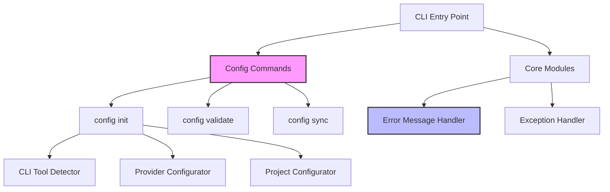

## 产品概述

CodePilot 是一个本地工程工作流 CLI 工具，用于把自然语言需求转换成可执行任务，并串起规划、执行、审查、巡检、服务运维和发布流程。

## 核心改进需求

1. **异常处理优化（P0）**：项目中有 345+ 处裸异常捕获（`except Exception`），需要替换为具体的异常类型，提高代码质量和可维护性。
2. **错误信息友好性（P1）**：部分 CLI 错误信息偏技术化，需要为用户提供可操作的错误提示。
3. **配置向导（P1）**：当前配置需要手动编辑 `AGENTS.toml`，缺少交互式配置向导。
4. **文档一致性（P2）**：部分文档中的命令示例与实际代码可能存在不一致。
5. **测试覆盖率（P2）**：核心模块的边界条件测试不足，需要补充。

## 功能内容与视觉效果

- 用户将看到更清晰、可操作的错误信息，包含修复建议
- 新增 `codepilot config init` 交互式配置向导
- 新增 `codepilot config validate` 配置验证命令
- 代码质量提升，异常处理更加精确

## 技术栈选择

- **编程语言**：Python 3.10+（保持现有栈）
- **CLI 框架**：Click（已使用）
- **配置格式**：TOML（已使用 `tomllib`）
- **测试框架**：pytest + pytest-cov（已配置）
- **代码质量**：ruff（项目已使用）

## 实现方案

### 1. 异常处理优化策略

**问题分析**：

- 发现 345+ 处 `except Exception` 裸异常捕获
- 部分已有 `# noqa: BLE001` 注释，说明是有意保留
- `errors.py` 已定义良好的异常层次结构（`CodePilotError` 及其子类）

**实施策略**：

1. **分阶段处理**：优先处理核心模块（gateway、storage、webapp）
2. **具体异常替换**：

- `subprocess` 相关 → `subprocess.TimeoutExpired`, `FileNotFoundError`
- `json` 相关 → `json.JSONDecodeError`
- `toml` 相关 → `toml.TOMLDecodeError`
- 数据库相关 → `sqlite3.Error`

3. **保留必要的裸异常**：

- 插件/扩展点（如 `event_plugins.py`）
- 清理代码（finally 块中的异常）
- 已标注 `# noqa: BLE001` 且有合理理由的

**性能考虑**：

- 异常类型具体化不影响性能
- 更精确的异常有助于快速定位问题

### 2. 错误信息友好性改进

**实施策略**：

1. 创建错误信息辅助函数 `codepilot/core/error_messages.py`
2. 为常见错误提供可操作的建议：

- 配置错误 → 提示运行 `codepilot doctor` 或 `codepilot config init`
- Provider 错误 → 提示检查 API Key 或运行 `codepilot exec --dry-run`
- 任务执行错误 → 提示查看日志 `codepilot task logs <id>`

3. 使用 Rich 格式化输出，高亮关键信息

### 3. 配置向导实现

**实施策略**：

1. 扩展 `codepilot/commands/config_cmd.py`
2. 新增 `codepilot config init` 交互式向导：

- 检测已安装的 CLI 工具（claude、codex、opencode）
- 配置 AI Provider（DeepSeek、OpenAI 等）
- 设置项目默认值（base_branch、task_workspace）
- 配置飞书机器人（可选）

3. 新增 `codepilot config validate` 命令：

- 验证配置完整性
- 检查 API Key 可用性
- 检查 CLI 工具可用性

### 4. 架构设计

#### 系统架构图



#### 模块划分

1. **配置向导模块**（`codepilot/commands/config_cmd.py`）：

- `config_init()` - 交互式初始化
- `config_validate()` - 配置验证
- `_detect_cli_tools()` - 检测 CLI 工具
- `_configure_provider()` - 配置 Provider

2. **错误信息模块**（`codepilot/core/error_messages.py`）：

- `format_error()` - 格式化错误信息
- `suggest_fix()` - 提供修复建议
- `error_handler()` - 统一异常处理装饰器

### 5. 目录结构

```
codepilot/
├── core/
│   ├── error_messages.py      [NEW] 错误信息格式化与建议
│   ├── exception_handler.py   [NEW] 统一异常处理装饰器
│   └── config.py              [MODIFY] 添加配置验证方法
├── commands/
│   └── config_cmd.py          [MODIFY] 添加 config init/validate 命令
├── gateway/
│   ├── execute.py             [MODIFY] 优化异常处理
│   ├── resolution.py          [MODIFY] 优化异常处理
│   └── api.py                 [MODIFY] 优化异常处理
├── webapp/
│   ├── server.py              [MODIFY] 优化异常处理
│   ├── payloads.py            [MODIFY] 优化异常处理
│   └── action_*.py            [MODIFY] 优化异常处理
└── tests/
    ├── test_error_messages.py  [NEW] 错误信息测试
    ├── test_config_init.py    [NEW] 配置向导测试
    └── test_exception_handler.py [NEW] 异常处理测试
```

### 6. 关键代码结构

```python
# codepilot/core/error_messages.py

from codepilot.errors import CodePilotError, ConfigError, ProviderError

def format_error(exc: Exception, context: str = "") -> str:
    """格式化错误信息，提供可操作的建议。"""
    if isinstance(exc, ConfigError):
        return _format_config_error(exc, context)
    elif isinstance(exc, ProviderError):
        return _format_provider_error(exc, context)
    elif isinstance(exc, CodePilotError):
        return _format_codepilot_error(exc, context)
    else:
        return _format_unknown_error(exc, context)

def _format_config_error(exc: ConfigError, context: str) -> str:
    """配置错误格式化。"""
    suggestions = [
        "运行 `codepilot doctor` 检查配置",
        "运行 `codepilot config init` 重新初始化配置",
        "手动编辑 `.codepilot/AGENTS.toml`"
    ]
    return f"[red]配置错误[/red]: {exc}\n" + "\n".join(f"  • {s}" for s in suggestions)
```

## 实施注意事项

1. **向后兼容**：不破坏现有 API 和命令
2. **渐进式改进**：分阶段实施，每个阶段可独立验证
3. **测试先行**：使用 TDD 模式，先写测试再实现
4. **代码审查**：关键改动需要人工审查
5. **文档同步**：代码改动后同步更新文档

## Agent Extensions

无相关扩展可用于此任务。任务主要涉及代码改进和新增功能，不需要额外的 Skill、MCP、SubAgent 或 Integration。