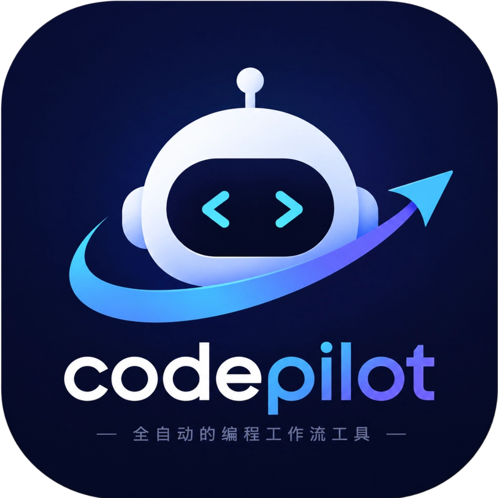

# CodePilot 说明文档

<p align="center">
  
</p>

语言版本：中文 | [English](02-overview.en-US.md)

## 1. 定位

CodePilot 是面向本地工程仓库的工作流编排 CLI，核心目标是把“需求 -> 澄清 -> 计划 -> 任务 -> 执行 -> 审查 -> 运维 -> 发布”流程标准化。

当前版本：`0.7.4`

**平台支持**：仅在 Windows 和 Linux 上测试通过。macOS 未经过充分测试，实际使用可能存在较多 bug。欢迎社区贡献 macOS 适配。

核心能力：

- 自然语言入口：`codepilot "需求"`、`go`、`chat`、Web UI、飞书。
- 执行前整理：`clarify` 生成需求规格，`plan` 生成可审查执行计划。
- 只读取证与知识沉淀：`explore`、`wiki`、`note`、`trace`。
- 任务生命周期管理：统一使用 `task ...` 子命令。
- 项目队列与后台服务：`run`、`daemon`、`inspect`、`ui`。
- 集成能力：飞书长连接机器人、Webhook、事件 sink、Hook registry、Provider 烟测。
- AI 友好接口：`ai manifest`、`ai guide`、`ai template`、常见命令的 `--json` 输出。
- 二进制构建与发布：统一使用 `binary ...` 子命令。

## 2. 架构概览

逻辑分层：

1. CLI 入口层：`codepilot/cli.py`、`codepilot/commands/*`
2. AI 与规划层：`codepilot/ai_support/*`、`codepilot/prompts/*`
3. 执行与运行时层：`run`、`daemon`、`inspect`、`build-fix`
4. 数据层：SQLite 项目、任务、日志、会话、服务状态
5. 交互层：终端输出、本地 Web UI、飞书、Webhook
6. 集成层：事件 sink、Hook registry、Provider exec、Skill catalog

主要目录：

- `codepilot/`：核心实现
- `codepilot/commands/`：CLI 子命令
- `codepilot/web/`：Web UI 前端资源
- `codepilot/webapp/`：Web UI 服务端动作和 payload
- `codepilot/templates/`：任务模板
- `docs/`：中英双语说明和操作文档
- `skills/`：可复用 Agent Skill
- `tests/`：pytest 测试

## 3. 命令域模型

### 3.1 入口与需求

- `codepilot "需求"`：顶层纯文本入口，适合一次性提交明确需求。
- `go`：显式自然语言入口，可处理需求，也可回答项目/任务问题。
- `chat`：OpenCode TUI 持续会话入口，适合连续问答、任务操作和工作流执行。
- `auto`：把高层目标拆为任务，可选择只规划不执行。
- `add`：外部 AI / 自动化系统直接投递任务的低层入口，人工日常不应直接使用。

### 3.2 澄清、计划与只读取证

- `clarify`：生成执行前需求规格，不创建任务、不执行代码。
- `plan`：生成可审查执行计划，不创建 backlog、不启动执行器。
- `explore`：只读探索项目文件、Git、任务、wiki 和 inspect 信号。
- `wiki`：维护项目本地 Markdown 知识库。
- `note`：维护项目持久工作记忆。
- `trace`：查看任务、日志、服务心跳和 workflow state 时间线。

### 3.3 任务与执行

- `status` / `hud`：查看任务看板和轻量工作台状态。
- `task show/logs/find/edit/stop/retry/resume/cancel/archive/done/rm/sweep`：任务全生命周期运维。
- `run`：执行项目 backlog。
- `daemon`：后台持续轮询并执行 backlog。
- `build-fix`：针对 failed 任务执行“失败收集 -> 重试修复 -> 验证 -> verdict”闭环。

### 3.4 服务、集成与发布

- `inspect`：巡检项目信号并产出候选任务。
- `ui`：Web UI 前台启动和后台服务管理。
- `feishu`：飞书企业应用长连接机器人。
- `webhook`：HTTP `/tasks` 投递入口。
- `event`：项目本地事件 sink registry。
- `hook`：项目级 hook wrapper 计划、验证和测试。
- `exec`：项目内 provider 命令烟测和审计执行。
- `skill`：项目本地 skill catalog 管理和运行。
- `binary`：构建、安装、发布、校验本平台二进制。
- `doctor`：环境、配置、数据库和服务健康检查。

## 4. 执行边界

强约束：

- 任务运维统一使用 `codepilot task ...`。
- 发布统一使用 `codepilot binary ...`。
- Web UI 服务统一使用 `codepilot ui ...`。
- `release` 顶层旧入口、顶层 `show/logs/stop/retry/find/...`、`webui` 旧入口已移除。
- `chat`、Web UI 会话和飞书自由文本统一交给 OpenCode + CodePilot MCP 处理；需要结构化规格或计划时显式使用 `clarify`、`plan` 或对应面板/MCP 工具。
- 项目状态、任务数量、完成度、失败任务、运行中任务、服务状态等输入优先按问答处理。
- `explore`、`clarify`、`plan` 默认不执行代码、不启动服务、不写业务文件。

## 5. 配置与状态

主配置文件：`AGENTS.toml`

常见配置域：

- `[project]`：项目标识、默认模式、基线分支
- `[automation]`：规划器、执行器、自动执行策略；`fallback_cli_order` 决定文本模式 CLI 兜底顺序（默认 `["claude", "codex", "opencode"]`）；`agent_language = "en" | "zh-CN"` 控制 agent-facing prompt、任务模板内容和期望输出语言，默认英文。
- `[inspect]`：巡检策略
- `[agents]` 与 `[agents.commands]`：planner/builder/reviewer 默认 + CLI family 命令映射（claude/codex/opencode）。旧版 `codex_cmd` / `claude_cmd` 标量已删除，加载时遇到会抛 `ConfigError` 并给出迁移示例。
- `[feishu_bot]`：飞书长连接机器人
- `[notifications]`：任务状态通知 webhook
- `[automation.scheduled_agents.<name>]`：定时 agent，必填 `agent`、`prompt`，并配置 `interval = "10m"` / `"1h"` / `"1d"` 或五段式 `schedule = "0 9 * * *"`。
- `[automation.event_agents.<name>]`：事件 agent，必填 `trigger`、`agent`、`prompt`，当前由事件流按 `trigger` 匹配生成 `agent_job`。

敏感信息建议放入 `.codepilot.secrets.toml`，不要提交到仓库。

### 5.1 Scheduled / Event Agent 配置

最小示例：

```toml
[automation.scheduled_agents.task_health]
enabled = true
agent = "codex"
interval = "10m"
prompt = "Review local CodePilot task status and summarize risks."
max_cost_usd = 0.10
max_daily_cost_usd = 0.50

[automation.event_agents.failed_task_triage]
enabled = false
trigger = "task.failed"
agent = "codex"
prompt = "Task {{ task_id }} failed with {{ error_message }}. Suggest the smallest repair."
max_cost_usd = 0.10
max_daily_cost_usd = 0.50
```

定时 agent 可通过以下命令查看和手动验证：

```bash
codepilot scheduled list -p <项目名>
codepilot scheduled show task_health -p <项目名> --json
codepilot scheduled run-once task_health --dry-run
codepilot scheduled run-once task_health -p <项目名> --dry-run
codepilot scheduled disable task_health -p <项目名>
```

本仓库默认的 3 个 scheduled agent：

- `task_health`：检查任务状态、失败任务、长时间 in-progress 任务和近期 scheduler 审计记录，只输出风险摘要和保守检查建议。
- `daily_summary`：准备项目日报摘要；只有飞书已配置时，后续链路才可把摘要用于飞书投递，agent 本身不直接发送消息。
- `auto_inspect`：基于现有 inspect 信号生成轻量巡检计划和可执行发现，要求避免直接改代码。

事件 agent 支持的事件类型取决于事件生产方，模板可读取事件 `payload` 中的字段；内置任务失败事件使用扁平字段，例如 `{{ task_id }}`、`{{ error_message }}`。飞书相关事件需要先完成 `[feishu_bot]` 配置并启动 `codepilot feishu start`；MCP 工具注入依赖对应 agent CLI 和 MCP launcher 能力，不应把未配置的 MCP / 飞书能力写成必然可用。

### 5.2 审计、成本与循环防护

scheduled / event agent 每次执行或 dry-run 都会向 `.codepilot/scheduled/audit.jsonl`
追加一行 JSON，不保存 prompt 明文，只保存 `prompt_hash`。主要字段：

- `timestamp`：审计记录时间。
- `trigger`：触发来源，例如 `manual`、`interval`、`schedule` 或 `event`。
- `project`、`job_name`、`agent`：项目、agent 配置名和 CLI family。
- `prompt_hash`：prompt 的 SHA-256 摘要，用于追踪而不泄露内容。
- `tools`、`token_usage`、`cost`、`exit_code`：执行元数据；dry-run 时通常为空、0 或 `null`。
- `agent_chain`：跨 agent 触发链，用于循环防护。
- `guard`、`notification`、`dry_run`：护栏状态、通知 payload 和是否为 dry-run。

成本护栏行为：

- `max_cost_usd` 限制单次调用成本；运行后解析到的 `cost` 超限时，结果标记为 `guard.status = "tripped"`，审计中记录 `reason = "max_cost_per_call"`。
- `max_daily_cost_usd` 限制单个 `project:name` 的日累计成本；超限后写入 `.codepilot/scheduled/guards.json` 并禁用该 agent，后续执行会被跳过，`reason = "disabled"`。
- 内部 runner 也支持 `max_tokens_per_call`，超过时记录 `reason = "max_tokens_per_call"`；当前 AGENTS 配置解析暴露的是成本字段。

循环熔断规则：

- 每个 job 会形成 `agent_chain`，当前 job key 格式为 `<project>:<name>`。
- 链路深度超过 5 时不会调用外部 CLI，直接审计为 `guard.status = "skipped"`、`reason = "loop_circuit_breaker"`。
- 手动执行 `codepilot scheduled disable <name> -p <项目名>` 会在 `guards.json` 中标记禁用；之后 dry-run 和真实执行都会先被 preflight 跳过。

文档和配置变更的手动验证命令：

```bash
pytest tests/test_scheduled_*
codepilot scheduled run-once task_health --dry-run
codepilot scheduled run-once task_health -p codepilot-dev --dry-run
```

### 5.3 OpenCode 专用模式

CodePilot 默认不修改 OpenCode 源码。`codepilot chat -a opencode` 启动前会写入并注入三类官方配置：

- `OPENCODE_CONFIG` -> `~/.codepilot/opencode/<项目标识>/opencode.json`：CodePilot MCP、默认 agent、commands、instructions、permission、tools。
- `OPENCODE_TUI_CONFIG` -> `~/.codepilot/opencode/<项目标识>/tui.json`：TUI theme、scroll、diff、mouse 配置和 CodePilot 品牌 TUI plugin。
- `OPENCODE_CONFIG_DIR` -> `~/.codepilot/opencode/<项目标识>/config`：OpenCode 原生 `agents/`、`commands/`、`instructions/` 和 `tui-plugins/codepilot-brand.tsx` 文件。
- `OPENCODE_DISABLE_TERMINAL_TITLE=1`：禁用 OpenCode 自己的终端标题更新，由 CodePilot 把终端窗口/标签标题设置为 `brand_name`。

OpenCode 套壳品牌、TUI、中文交互规则、默认 agent 和内置 commands 是 CodePilot 工具级定制，随包代码发布。业务项目不需要、也不应该为了使用这个工具在 `AGENTS.toml` 中配置 `[opencode.profile]`、`[opencode.agent]` 或 `[opencode.commands]`。业务项目目录不会生成 `.codepilot/opencode/`；运行时文件只写入用户级 `~/.codepilot/opencode/<项目标识>/`，用来落地当前项目的注册名、MCP 启动配置、隔离 OpenCode 会话数据和项目级模型选择。

业务项目可以配置的是运行策略：

- `[agents.commands].opencode`：指定使用哪个官方 OpenCode 命令或本地开发命令。
- `[providers.<name>]`：配置 OpenAI、DeepSeek、Qwen、Kimi、Gemini、Claude 或其他 OpenAI 兼容供应商。CodePilot 会按 provider 名动态生成 OpenCode provider，不把所有自定义模型塞进 `openai` 分类。
- `[opencode.permission]`：配置当前项目的 OpenCode 权限模式，支持 `ask`、`full_access` 和 `custom`。

模型选择持久化：

- 用户在 OpenCode TUI 中切换模型后，CodePilot 会从隔离的 OpenCode 会话库同步本次模型选择。
- 同一项目的新会话优先使用 CodePilot 保存的项目级模型选择。
- 如果没有保存过项目模型，OpenCode 内置免费默认模型不会覆盖项目配置里的 provider/model。

权限分层：

- OpenCode 第一层使用 `permission`，默认把 `bash`、`edit`、`write`、`webfetch` 设为 `ask`。
- 如果项目可信，可在 `AGENTS.toml` 中设置 `[opencode.permission] mode = "full_access"` 跳过 OpenCode 权限弹窗。
- 如果需要细粒度规则，可设置 `mode = "custom"` 并在 `[opencode.permission.rules]` 中配置 `bash`、`edit`、`write`、`webfetch` 等规则。
- CodePilot MCP 工具内部保留二次校验，例如 `exec` 只允许白名单命令，任务/飞书/Webhook/hook 入口按各自工具参数和项目上下文校验。

官方 OpenCode 模式只需要 `[agents.commands].opencode = "opencode"`。无源码路径可以覆盖终端窗口/标签标题、首页 logo、侧栏标题/页脚。当前项目不维护 OpenCode 源码 overlay 或自定义二进制；如果 OpenCode TUI 内部其他硬编码欢迎语、权限弹窗文案仍显示 OpenCode，先记录为官方二进制不可配置边界。

手动 smoke：

```bash
codepilot chat -a opencode
```

期望能看到 CodePilot MCP 启动反馈，随后进入 OpenCode TUI，并能使用 CodePilot MCP 相关任务/状态命令。

退出体验：

- 启动过渡页使用临时终端屏幕，进入 OpenCode 前会退出临时屏，不写入主终端历史。
- OpenCode 退出后 CodePilot 只打印紧凑恢复提示，不再整屏清空终端。
- 恢复命令使用 `codepilot chat --session <session_id>`，继续使用 CodePilot 的隔离配置、MCP 和会话数据。

数据库持久化内容：

- 项目注册信息
- 任务、依赖关系、状态、日志和交付记录
- 会话、工作流状态、服务心跳
- 事件 sink、wiki、note、skill catalog 等项目级状态

常见任务状态：

- `backlog`
- `in_progress`
- `done`
- `failed`
- `cancelled`
- `archived`

## 6. 对外集成方式

推荐入口：

- 非交互需求：`codepilot "需求"`
- 问答：`codepilot go "当前项目状态怎么样" -p <项目名>`
- 结构化采集：`status --json`、`hud --json`、`task show --json`、`task find --json`、`trace --json`、`doctor --json`
- 标准命令描述：`codepilot ai manifest`
- 飞书长连接：`codepilot feishu start`
- 外部任务投递：`codepilot webhook --host 127.0.0.1 --port 8765`
- 外部 AI 直接投递任务：先读 `codepilot ai template --format json`，再提交模板合规 content

详细命令集合见：

- 操作文档：[中文](03-操作文档.zh-CN.md) / [English](03-operation-guide.en-US.md)
- AI/Agent 调用：[中文](04-AI与Agent调用手册.zh-CN.md) / [English](04-ai-agent-manual.en-US.md)
- Skill 化集成：[中文](05-Skill化集成指南.zh-CN.md) / [English](05-skill-integration-guide.en-US.md)
- 项目服务说明：[中文](06-项目服务改造说明.zh-CN.md) / [English](06-project-services.en-US.md)
- 工作流状态约定：[中文](07-workflow-state.zh-CN.md) / [English](07-workflow-state.en-US.md)

## 7. 版本更新日志

版本划分依据来自 Git 历史中的连续大功能批次；早期缺失的历史 tag 已按能力边界回填为语义化版本。`0.x` 阶段允许在 minor 版本中包含入口调整和配置迁移。

### 0.7.4 - 2026-05-20

- Windows：修复 `codepilot ui restart` 后后台 Web UI 子进程弹出黑色控制台窗口的问题。
- 服务启动：后台服务统一追加 `CREATE_NO_WINDOW` 和隐藏启动信息，避免 console 子系统二进制创建可见窗口。
- 测试：补充冻结二进制 Web UI/服务后台启动的隐藏窗口回归覆盖。

### 0.7.3 - 2026-05-20

- 二进制：完整核对业务资源，构建/安装/release 产物会携带飞书 JS 运行时 sidecar。
- 飞书：随包包含 `package.json`、`package-lock.json`、`node_modules` 和 `feishu_*.mjs`，避免系统安装后缺 Node SDK。
- 发布：冻结二进制下飞书服务从安装目录 `feishu/` 读取运行时文件，发布包校验覆盖该目录。

### 0.7.2 - 2026-05-20

- Web UI：修复打包后二进制找不到 `index.html` 的问题，静态资源优先从包资源读取并保留源码路径兜底。
- 二进制：PyInstaller 构建显式加入整个 `codepilot/web` 目录，避免嵌套前端资源在发布包中缺失。
- AI 集成：新增 `agent_language` 配置，并补齐 AI manifest / 使用手册的中英文输出支持。

### 0.7.1 - 2026-05-20

- Web UI：修复打包后二进制后台启动时误用 `-m codepilot` 导致 `No such option: -m` 的问题。
- 配置：新增 `CODEPILOT_WEBUI_HOST` / `CODEPILOT_WEBUI_PORT` 覆盖默认监听地址和端口。
- 数据隔离：新增 `CODEPILOT_HOME` 覆盖全局状态根目录；`codepilot-dev` 默认使用 `~/.codepilot-dev` 与端口 `8767`。
- 兼容：正式 `codepilot` 继续使用 `~/.codepilot`，保留既有任务 DB、服务状态和项目运行数据。

### 0.7.0 - 2026-05-20

- 配置治理：新增 `config init`、`config validate`，并优化配置异常提示。
- Codex 兼容：增加 Codex CLI 会话存储与 Windows TUI 兼容支持。
- MCP 与 WebApp：强化任务模板校验、session 检测和文件搜索性能。
- OpenCode 路径：补齐文件上传、`@` 文件引用、配置自动修复和默认 OpenCode 运行链路。

### 0.6.0 - 2026-05-08 至 2026-05-13

- OpenCode runtime、CLI family 注册表、provider 动态配置、env bridge 和 fallback 链路成型。
- CodePilot MCP server、工具注册表、任务/上下文/运维/外部集成工具和 chat 生命周期绑定落地。
- scheduled / event agent、agent_job、审计日志、成本护栏、循环熔断和默认 scheduled agent 落地。
- 二进制构建支持 vendor CLI 抓取、校验、缓存、bundled CLI 打包与安装释放。

### 0.5.0 - 2026-04-29 至 2026-04-30

- 新增 `explore`、`wiki`、`note`、`trace`、`hud`、`clarify`、`plan`、`build-fix`、`skill`、`hook` 等项目工作流入口。
- 增强项目级 setup、事件插件、wiki ingest、会话上下文保留和本地技能运行。
- 飞书交互、中文命令别名、项目注册、安全确认、需求提交和会话继续能力成型。
- DeepSeek provider、任务模板示例、Web UI 草稿隔离和通知呈现补齐。

### 0.4.0 - 2026-04-24 至 2026-04-28

- 命令面板收敛为 `task` / `ui` / `binary` 分组，并明确淘汰旧入口。
- reviewer verdict、Web verdict 面板、progress bus、SSE 扩展事件和 LLM heartbeat 渲染落地。
- 任务模板合规校验强化，删除 `--no-ai` / `--allow-empty` 占位通道，支持 Markdown 批量导入。
- 飞书长连接控制、自然语言命令分发、敏感操作二次确认和 secrets 覆盖配置成型。

### 0.3.0 - 2026-04-20 至 2026-04-23

- dual phase agents、worktree 隔离执行、AI triage、项目级 provider 覆盖和全局配置叠加落地。
- webhook 服务、项目服务化、daemon 状态反馈和 inspect 依赖健康/代码规模/复杂度信号落地。
- AI Gateway、auto workflow、chat/webui/go 交互控制器、inspect 信号采集和存储层边界大规模拆分。
- Web UI SSE、任务/会话/需求分页、批量操作、归档和 planner 质量门增强。

### 0.2.0 - 2026-04-16 至 2026-04-19

- chat mode、Web UI、AI intent routing、daemon 自动启动 UI、WebUI 持久服务和会话管理落地。
- doctor、cleanup、inspect 定时扫描、任务去重、任务 cancel/resume/stats 等运维入口补齐。
- per-task feature branch、进程树清理、Windows 控制台编码修复和 Rich markup 安全转义落地。
- 引入需求澄清与侦察阶段，拆分 planner/executor，并开始拆分 AI、run、binary 等大模块。

### 0.1.0 - 2026-04-11 至 2026-04-12

- 初始化自然语言工作流 CLI。
- 接入 Codex 默认工作流、运行时控制、二进制打包和版本化发布流程。
- 提供 AI integration manifest、发布说明和基础审查产物。
